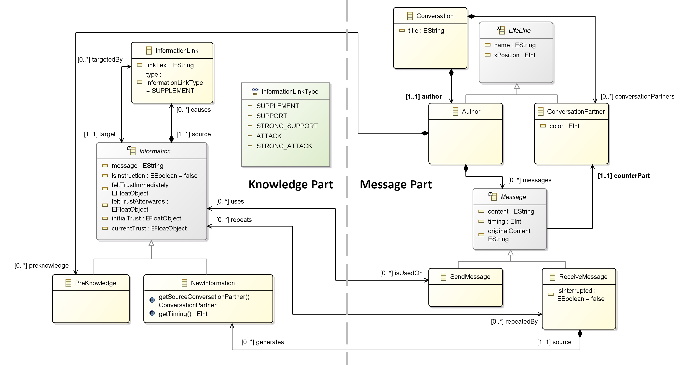

# KEML (metamodel)

KEML is an [Eclipse EMF project](https://projects.eclipse.org/projects/modeling.emf.emf) meaning it consists of a set of Eclipse Plugins that create several handy editors and analyzers for KEML files. Each of these plugins forms a project of the [KEML group](https://github.com/keml-group). You are currently viewing the **KEML model project**. It basically holds the central definition of the KEML metamodel as an .ecore file and can be used to generate the model java classes and further projects (see [Code Generation](#Code-Generation)).

## The KEML ecore model (semantics)

KEML is designed to document LLM conversations (i.e. messages) and the knowledge gained from them.
It combines two well-known modelling techniques, that is sequence diagrams for the **message part** and argumentation graphs for the **knowledge part**.
Both techniques have been adapted to fit the specific needs of KEML.

An in depth introduction of KEML will be available in our [introductory paper](https://doi.org/10.1145/3652620.3687809) - that will be published in September 2024.

## Requirements
This project is an Eclipse Modeling project, meaning that it should be opened with [Eclipse Modeling Tools](https://www.eclipse.org/downloads/packages/release/2024-03/r/eclipse-modeling-tools). You can add those to an existing Eclipse installation or install them from scratch. More information on this is best retrieved by the eclipse foundation.

## Installation
When using this project in Eclipse, make sure that it is correctly recognized as a Modeling Project (indicated by a small M on the project icon):

1. Right-click on the project and select Properties
2. Choose Project Natures
3. Add the Modeling Nature
4. Apply and Close

Also check if the Maven nature is correctly configured. You will get class not found errors if it is not. Just adding the maven nature like the modeling nature before did not work on Eclipse 2023-12. Instead one should:

1. Right-click on the project and select Configure
2. Choose Convert to Maven Project

Afterwards, the project can be compiled and executed.

## Code Generation
Based on the ecore file, you can generate code:
* for all KEML java classes (data types), stored under src-gen
* for the helper project [keml.edit](https://github.com/keml-group/keml.edit)
* for the keml.editor

To generate code:
1. Open the ecore file under model/keml.ecore/keml/keml in Eclipse Modeling Tools.
This should open the graphical view you see above.
2. On the graphical view right-click to open a dialogue.
3. Choose the dialogue option Generate -> All to generate all relevant code of all three projects or single parts to generate just those.

### Code generated under src-gen
If you generate "Model Code" (or "All") this will (re-)generate all code in this project's folder **src-gen**. This folder is deliberately not checked in, since it just holds generated code.
The generated code follows the Factory Pattern:
There are java interfaces for each KEML type under src-gen/keml, and Impls for the types under src-gen/keml.impl.

### Special care for keml.edit
Since the keml edit project has some customizations, it is recommended to get it from the [keml.edit repository](https://github.com/keml-group/keml.edit). A later code generation does not overwrite the changes brought in by the keml.edit repository.
For more details, check keml.edit's repository documentation.

### Learning how to use EMF Modeling Projects
To read more about working with modeling projects and code generation, we highly recommend the Eclipse tutorial on [Domain Models](https://wiki.eclipse.org/Sirius/Tutorials/DomainModelTutorial).

## License
The license of this project is that of the [group](https://github.com/keml-group).
